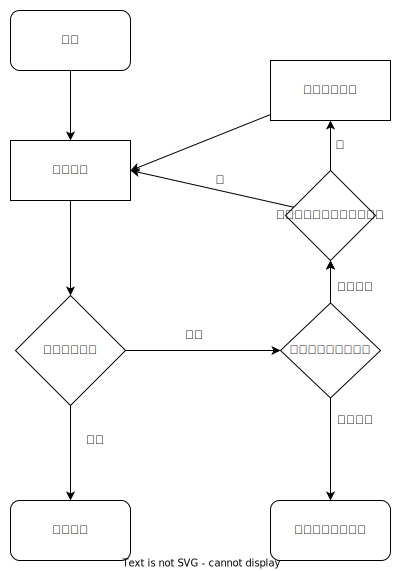

# Retryer

------

简洁可定制的重试器，可简便地用于常见的任务重试，如http调用等

## 使用方法

### 概述

一个典型的重试过程由任务执行，重试等待，重试执行，最终得到结果或最终失败这四部分组成。流程如下：



其中，执行结果判断、任务失败后的重试终止策略及休眠（任务间隔）策略，是决定充实任务执行过程的关键。Retryer支持对这三者进行配置来自定义重试行为（重试命令RetryCommand），也提供了简便的可快速创建的重试器。

| 策略名称         | 执行时机                          | 策略类              |
| ------------ | ----------------------------- | ---------------- |
| 结果判断策略（成功策略） | 任务单次运行结束后                     | SuccessStrategy  |
| 终止策略         | 任务单次运行结束并被判断失败后               | stopStrategy     |
| 间隔策略         | 任务单次运行结束并被判断失败，经终止策略判断仍需继续重试后 | IntervalStrategy |

此外，在使用自定义重试命令时，还支持指定任务执行成功及失败后的回调。

### 简单重试

```java
/**简单重试的使用*/

public class SimpleRetryerExample {

    int times = 0;

    public static void main(String[] args) {
        Retryer retryer = new Retryer(); //创建重试者
        RetryCommand retryCommand = new SimpleRetryCommand(2, Duration.of(1, ChronoUnit.SECONDS));  //指定重试两次，每次间隔1秒的重试命令
        FinalResult<Void> finalResult = retryer.retry(new SimpleRetryerExample()::testMethod, retryCommand); //执行重试
        System.out.println("重试结果：" + finalResult);
        //如果重试方法有返回，可通过finalResult.getResult方法获取结果；通过finalResult.getException获取最后一次运行的异常
    }

    /**
    自定义的示例方法
    */
    void testMethod() {
        ++times;
        if (times < 3) {
            throw new IllegalStateException("错误了！times为：" + times);
        }
        System.out.println("运行正常！times为：" + times);
    }
}
```

### 自定义重试

自定义策略重试示例如下

```java
public class CustomRetryerExample {
    int times = 0;

    public static void main(String[] args) {
        Retryer retryer = new Retryer();
        RetryStrategy retryStrategy = RetryStrategy.create()
                .intervalStrategy((taskResult, processResult) -> Duration.of(processResult.getAttemptCount(), ChronoUnit.SECONDS))  //重试间隔策略
                .stopStrategy( new StopStrategy.StopWithLimitStrategy(4))  //失败后重试策略
                .successStrategy(SuccessStrategy.DEFAULT_NO_EXCEPTION)  //执行结果判断策略
                .build();
        RetryCommand retryCommand = new CustomRetryCommand(retryStrategy, Actions.create()
                .taskFailureAction(((taskResult, processResult) -> System.out.println("Exception:" + taskResult.getException()))) //单次任务执行失败后回调
                .build());    //配置重试命令，使用自定义的重试策略，并配置每次任务失败后的回调
        retryer.retry(new CustomRetryerExample()::testMethod, retryCommand);     //执行重试
    }

    /**
    自定义的示例方法
    */
    void testMethod() {
        ++times;
        if (times < 5) {
            throw new IllegalStateException("错误了！times为：" + times);
        }
        System.out.println("运行正常！times为：" + times);
    }
}
```

## 设计

参考[Design.md](Design.md)
